# URL Shortener

Creation Date: Feb 5, 2025
Author: neonmei
Status: In Review

# Indice

- [URL Shortener](#url-shortener)
- [Indice](#indice)
- [Background](#background)
- [Solucion propuesta](#solucion-propuesta)
  - [Arquitectura y stack](#arquitectura-y-stack)
  - [Estructura de datos](#estructura-de-datos)
  - [Caching](#caching)
  - [Telemetria](#telemetria)
  - [Sobre `url_id`](#sobre-url_id)
  - [SLOs](#slos)
  - [API: Superficie publica](#api-superficie-publica)
    - [GET /{url\_id}](#get-url_id)
      - [Request](#request)
      - [Response](#response)
  - [API: endpoints administrativos](#api-endpoints-administrativos)
    - [POST /v1/urls/short](#post-v1urlsshort)
      - [Request](#request-1)
      - [Response](#response-1)
    - [DELETE /v1/urls/short/{url\_id}](#delete-v1urlsshorturl_id)
      - [Request](#request-2)
      - [Response](#response-2)
    - [GET /v1/urls/short/{url\_id}](#get-v1urlsshorturl_id)
      - [Request](#request-3)
      - [Response](#response-3)
- [Implementacion](#implementacion)
- [Backup](#backup)


# Background

Los acortadores de URLs son herramientas esenciales para optimizar enlaces largos, facilitar su distribución y permitir el seguimiento de métricas. En el contexto de MercadoLibre, esto es crítico para campañas de marketing, trackeo de tráfico y mejorar la experiencia del usuario final. La principal necesida de negocio surge de poder disponibilizar URLs largas como `https://eletronicos.mercadolivre.com.br/seguranca-casa/#menu=categories` en espacios donde hay limitantes de caracteres como mensajes de texto o redes sociales. Un servicio de acortamiento propio permitiría generar URLs cortas similares a `https://me.li/XXYYZZ`, pudiendo asi intervenir y aumentar el alcance de campañas en redes sociales.

Se espera que dicho servicio tenga alta disponibilidad y baja latencia bajo trafico pico de 50 kRPS.

# Solucion propuesta

## Arquitectura y stack

Se propone el desarrollo de un servicio HTTP de acortamiento de URLs cuyo backend de almacenamiento sea una solucion NoSQL como DynamoDB. Esta decision de storage se sustenta en que no requerimos fuertes garantias de consistencia, es administrado por AWS con un [buen SLA](https://aws.amazon.com/dynamodb/sla/) y escalable horizontalmente lo que nos permite arrancar pequeño e ir creciendo conforme el servicio vaya evolucionando.

NOTA: *Se da sobreentendido que entorno debe disponer capacidad de escalamiento horizontal (utilizando soluciones como Karpenter, HPA), apropiada distribucion sobre AZs y WAF para mitigar DDoS u otros tipos de probing que generen impacto operativo.*

```mermaid
architecture-beta
    group cloud(cloud)[Cloud]
    group eks(logos:aws-eks)[Cluster] in cloud

    service waf(logos:aws-waf)[WAF] in cloud
    service elb(logos:aws-elb)[Load Balancer] in cloud
    service dynamo(logos:aws-dynamodb)[storage] in cloud
    service pod1(logos:aws-ec2)[URL Shortener] in eks
    service pod2(logos:aws-ec2)[URL Shortener] in eks

    waf:R -- L:elb
    elb:R -- L:pod1
    elb:R -- L:pod2
    pod1:R -- L:dynamo
    pod2:R -- L:dynamo
```



A nivel no funcional se espera que el servicio tenga un codepath de lectura pesado (50 kRPS) debido a la base de usuarios de MELI, pero no tanto asi para el camino de escritura ya que el mismo es privado y esta atado a acciones de difusion de marketing (i.e: campañas de marketing localizada en las business hours de los mercados operados, sin casos de loyalty, retencion, cupones en la presente iteracion). Por lo señalado anteriormente y segun el medio de difusion, se puede esperar que en el path de lectura el trafico se comporte a un spike similar a los stress test en el cual uno o pocos recursos son leidos con grandes volumenes de trafico.

## Estructura de datos

Se propone la siguiente estructura de datos sobre un DynamoDB:

| key        | type       | notes                                      |
|------------|------------|--------------------------------------------|
| url_id     | string[PK] | este es el identificador o hash de URL     |
| created_at | string     | timestamp en el cual se creo la URL        |
| created_by | string     | usuario que creo la URL                    |
| enabled    | boolean    | si la URL esta disponible para ser servida |
| full_url   | string     | URL completa a la cual redirigir           |

La misma se propone como version inicial sencilla y que puede iterarse conforme el negocio demande nuevos requerimientos (i.e: revisiones, auditoria, etc).

## Caching

Esto responde a que el caso de uso es ser un acortador de URLs para difusion de marketing, segun los parametros descritos en el titulo de [Arquitectura y stack](#arquitectura-y-stack). Es por esto que la solucion *debe implementar una solucion de cache en memoria* sea LRU o TinyLFU (con admission) para poder dar mejor performance, resiliencia y menor consumo de recursos del storage de backend. En cuanto a estrategia de invalidacion de cache, los datos no se espera vayan mutando por lo que un dato viejo sirve y no es necesario hacerle eviction duro (de alguna manera se aliviana problemas como thundering herd pudiendo a lo sumo hacer un refresh asincrono). Una consideracion operativa de este approach es que, en caso de tener una desconexion del storage backend los requests podrian seguir sirviendose temporalmente -de forma degradada- con el contenido de la cache pero de todas formas de requerir un mejor SLA se pueden evaluar otras alternativas como multiples

Hay que tener presente que al poder borrarse una URL, tenemos que poder cambiar la respuesta en todas las replicas a `404 Not Found` y mantener esa consistencia. Para solventar esto en entornos escalados horizontalmente hay varias estrategias a validar en este RFC, pero una podria ser tener un endpoint administrativo que permita invalidar o sobre-escribir entradas puntuales en la cache, apalancado en la capacidad de endpoint discovery de Kubernetes (headless service) o de traffic shadowing sobre ese endpoint ofrecido por algunos service mesh. Si se borra una URL, no debe borrarse de la cache en memoria sino mas bien guardarse como una entrada de negative cache (para asi evitar que un borrado durante un pico de trafico implique que todos esos requests terminen impactando en el backend por cache miss).

Esta estrategia de cache debe ser validada con una prueba de carga representativa.

## Telemetria

La aplicacion debe generar estadisticas sobre los hits de la URL para conocer asi el alcance de las campañas de marketing y poder proveer informacion al negocio. Asi como indicadores tecnicos generales.

* `meli.shortener.url.hits`: counter, tags: `url_id`

El servicio debe estar instrumentada con OpenTelemetry utilizando las convenciones del SDK del equipo de plataforma y se espera que las trazas incorporen contexto relevante a la operacion realizada. Se espera que la cache anteriormente descrita exponga metricas internas de funcionamiento (i.e: hitratio) para tener informacion sobre el grado de eficiencia, asi como informacion general de metricas R.E.D (request rate, errors, duration).

## Sobre `url_id`

**Formato y validacion**

Se asume como invariante que `url_id` es un identificador alfanumerico con mayusculas y minusculas. Hay que tener presente que este identificador debe ser siempre validado y si algun endpoint lo utilizara (i.e: `GET /{url_id}`) debe devolver un error 4xx caso que no respete estas reglas. Esta invariante permite a futuro iterar e incorporar la funcionalidad de usar URLs "custom" `http://me.li/hotsale25` ya que siguen siendo valores alfanumericos.

**Generacion**

Hay varios enfoques para la generacion de `url_id` segun las necesidades y tradeoffs en el camino de generacion. Al tener un camino de escritura muy bajo, entendemos que approaches con espacios de valores mas altos o servicios dedicados de hashing son innecesarios y se puede optar por algo mas frugal.

En ese sentido se propone utilizar un generador basado en [Base62] (caracteres alfanumericos) *cuyo limite suave sea 7 caracteres*. Con suave entendemos que dicho limite no es enforceado a nivel storage sino a nivel API, por lo que es expandible. Entendemos que este espacio de valores es bastante grande para el caso de uso ya que puede representar `62^7 - 1 ~ 3.521.614.606.207`. Para ejemplificar y poner en perspectiva, si asumimos 15 mercados que lancen 8 campañas diarias cada uno (es decir 120 por dia) los 365 dias del año durante 20 años estamos hablando de `~ 876.000` valores (aprox 10% probabilidad de colision).

## SLOs

Se propone las siguientes metricas como indicadores de nivel de servicio:
- Latencia: <10ms en el p95 del endpoint de redireccion
- Disponibilidad: 99.99%

Evaluar con el negocio los objetivos de engagement segun experiencia en campañas previas.


## API: Superficie publica

### GET /{url_id}

Este endpoint recibe un ID de URL y caso de ser una operacion exitosa redireccionar con HTTP. Este endpoint necesariamente debe utilizar la cache y en caso de no disponer de los datos buscarlos en el backend.

#### Request

```
GET /{url_id}
```

#### Response

Status codes:
- 302 Found: La URL ha sido encontrada y se procede a redireccionar
- 404 Not Found: La URL no existe o el url_id es invalido
- 500: Error al acceder al storage backend

En el caso de error 4xx o 5xx se debe devolver una pagina con diseño indicando el motivo de error.

## API: endpoints administrativos

Se pone a disposicion endpoints para crear, borrar y obtener informacion de URLs acortadas. Estos endpoints deben estar protegidos siguiendo las convenciones del equipo de plataforma para endpoints administrativos (i.e: authorizer, apigw, no ser expuestos en una zona publica, etc).

En caso de haber un body con respuesta la misma debe ser en formato JSON. En el caso de los errores se espera una respuesta similar a la siguiente:

```json
{
  "error": "detalle del error"
}
```

Hay que tener presentes los siguiente status codes comunes:
- 401 Unauthorized: el usuario debe autenticarse
- 403 Forbidden: el usuario debe tener permisos

### POST /v1/urls/short

#### Request

Este endpoint recibe una URL larga y en caso de exito debe devolver una url corta dentro de un JSON.

```
POST /v1/urls/short
```

*Body*
```json
{
  "full_url": "https://eletronicos.mercadolivre.com.br/seguranca-casa/#menu=categories"
}
```

Consideraciones:
- **Idempotencia**: Si `full_url` ya existe, se retorna una `url_id` nueva para tener tracking diferenciado.
- **Validación**: La URL debe seguir especificaciones de URL https valida, debe tener un largo maximo de 1024 caracteres (configurable) y no debe apuntar a `me.li` (en una futura iteracion si se desea puede incorporarse gestion de dominios permitidos).

#### Response

```json
{
  "short_url": "https://me.li/abc"
}
```

Status codes:
- 201 Created: Acortamiento OK
- 400 Bad Request: error en el input (i.e: URL invalida)
- 500: Error al acceder al storage backend

Falta la URL, la misma es incorrecta o la url es otra url corta (reserved domains), duplicada?

### DELETE /v1/urls/short/{url_id}

Este endpoint borra la URL cuyo identificador es `{url_id}`. Este endpoint necesariamente se espera que contemple invalidacion de caches (negative cache) en todas las replicas del servicio.

#### Request

```
DELETE /v1/urls/short/{url_id}
```

#### Response

Status codes:
- 204 No Content: borrado exitosamente
- 404 Not Found: el `url_id` no existe
- 500: Error al acceder al storage backend

### GET /v1/urls/short/{url_id}

El mismo sirve para acceder a informacion sobre una URL corta activa o borrada.

#### Request

```
GET /v1/urls/short/{url_id}
```

#### Response

```json
{
  "full_url": "https://eletronicos.mercadolivre.com.br/seguranca-casa/#menu=categories",
  "enabled": true,
  "created_at": 1738879115,
  "created_by": "luz@neonmei.cloud",
}
```

Status codes:
- 200 OK: Informacion sobre la url
- 404 Not Found: url_id inexistente
- 500: Error al acceder al storage backend

# Implementacion

Al ser un servicio nuevo, se propone:
* Realizar una prueba de carga en entorno productivo que modele un escenario real pero relativamente desfavorable.
* Hacer un rollout en etapas, eligiendo una poblacion de usuarios y dando seguimiento a las metricas de nivel de servicio.


# Backup

El principal componente de storage seria DynamoDB que entendemos que al ser un bajo volumen de datos, podria usarse [DynamoDB PITR](https://aws.amazon.com/dynamodb/pitr/) junto a deletion protection.

[cache-aside]: https://learn.microsoft.com/en-us/azure/architecture/patterns/cache-aside
[Base62]: https://en.wikipedia.org/wiki/Base62